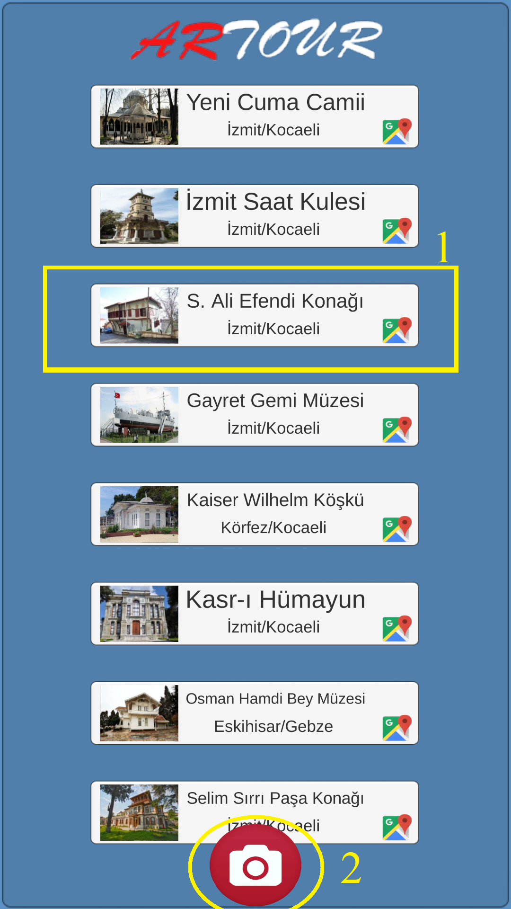
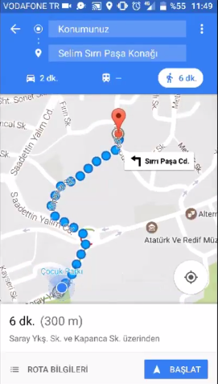
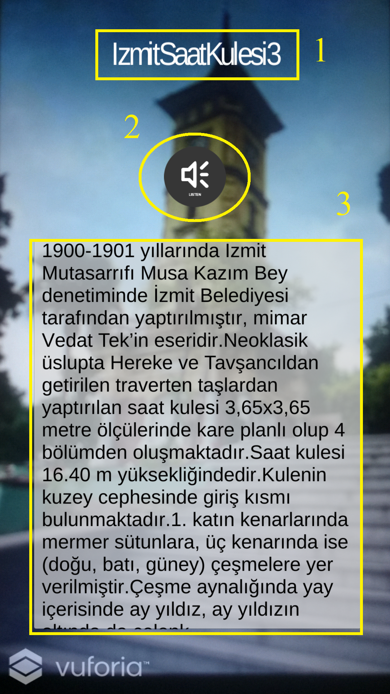
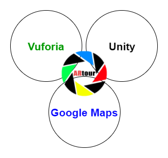
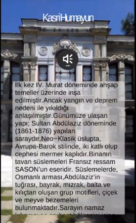
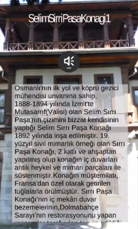
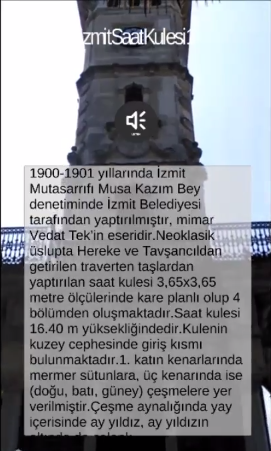

### ArTour: Artırılmış Gerçeklik Tabanlı Mobil Turist Rehberi
ArTour projesinin amacı, Artırılmış Gerçeklik teknolojisine dayanan turistik bilgiler için bir mobil hizmet uygulaması geliştirmektir. ArTour’un özel amaçlarından bir tanesi, belirli bir donanım yerine standart akıllı mobil cihazları kullanmaktır. ArTour, artırılmış gerçeklik ve sesli bilgiler ile zenginleştirilmiş içerikleri turistik yerleri keşfetmek ve daha iyi tanımak isteyen son kullanıcıları hedeflemektedir.

Birinci şekilde 1 ile numaralandırılmış her bir butonda turistik mekanlara ait fotoğraf, turistik mekanın adı ve kısa bir adresi yer almaktadır. Bunun yanı sıra bir Google Maps ikonu gözükmektedir. Bu butonlara basıldığında Google Maps açılmaktadır ve turistik mekanın konumu gösterilmektedir. Bu harita ile kullanıcının konumundan turistik mekana rota belirlenerek yol tarifi alınabilmektedir. Şekilde görülen 2 ile numaralandırılmış buton ise uygulamanın Artırılmış Gerçeklik kamerasına geçiş yapmasını sağlamaktadır. 

İkinci şekilde ise ArTour uygulamasının kullanıcılara turistik mekanların yol tarifinin aktarıldığı Google Maps kullanılarak oluşturulan harita özelliği gösterilmektedir. Bu ekran görüntüsünde kırmızı ile işaretli olan nokta turistik mekanın konumunu, mavi nokta ise kullanıcının konumunu göstermektedir. Bunların yanı sıra aradaki mesafe ve rotanın süresi de gösterilmektedir. 

Üçüncü şekil ile gösterilen ekran görüntüsünde ise ArTour’un sağlamış olduğu artırılmış gerçeklik özellikleri gösterilmektedir. Resim üzerinde gösterilen 1 numaralı alan turistik mekanın adını, 3 numaralı alan ise turistik mekanın bilgilerini içeren metin kutusunu göstermektedir. 2 olarak numaralandırılmış buton ise turistik mekanın bilgilerini kullanıcılara sesli olarak aktarmayı sağlamaktadır. 

 
 
 

Uygulama üç temel bileşen kullanılarak geliştirilmiştir. Uygulamanın temelini oluşturan bu bileşenler şunlardır: Unity, Vuforia, Google Maps.

### Gerçek Hayatta ArTour
ArTour uygulamasının son kullanıcılar ile olan etkileşimini ve uygulamanın alınan verimi ölçmek amacıyla İzmit merkezde bulunan Kasr-ı Hümayun, İzmit Saat Kulesi ve Selim Sırrı Paşa Konağını kapsayan testler yapılmışıtr. Aşağıda gösterilen resimler mobil cihaz üzerinde ArTour uygulaması çalışırken alınmış ekran görüntüleri ile elde edimiştir. 

 
 
